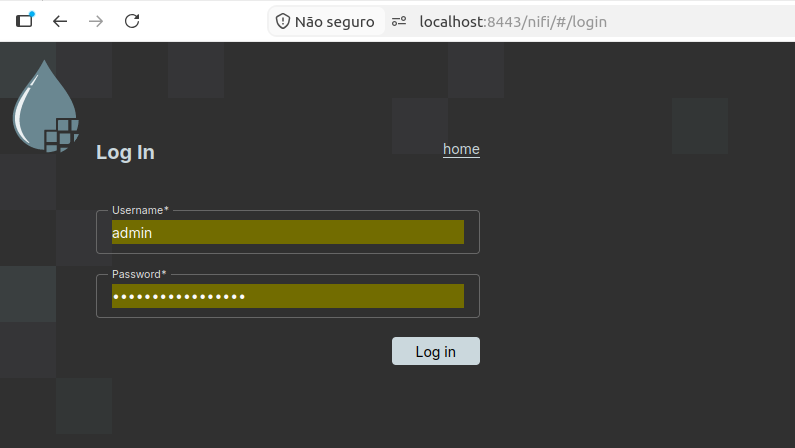
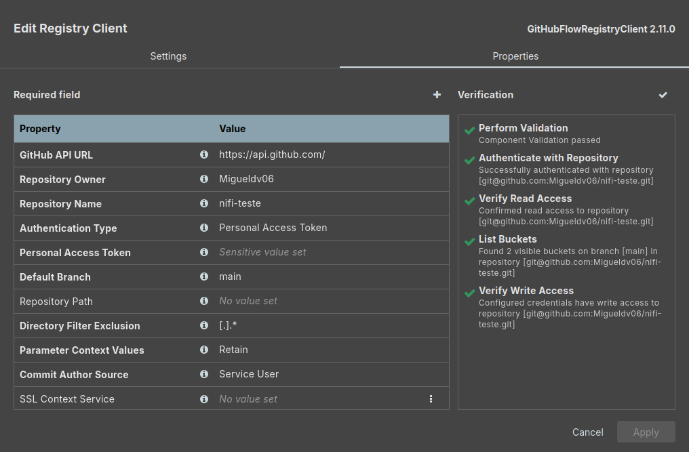

# Ambiente NiFi + MiNiFi

Este repositório contém a configuração de um ambiente Apache NiFi (via Docker) integrado a agentes MiNiFi, com sincronização automática de flows através do GitHub Actions.

## Índice

- [NiFi](#nifi)
  - [docker-compose.yaml](#docker-composeyaml)
  - [Criando as pastas necessárias](#1-criando-as-pastas-necessárias)
  - [Ajustando permissões](#2-ajustando-permissões)
- [MiNiFi](#minifi)
  - [bootstrap.conf](#confbootstrapconf)
- [GitHub Actions](#github-actions)
  - [Workflow de conversão do flow](#workflow-de-conversão-do-flow)
- [Configurações extras](#configurações-extras)
  - [Conectar o NiFi ao GitHub](#conectar-o-nifi-ao-github)
  - [Flow com atualização dinâmica](#configurando-flow-para-atualização-dinâmica)
- [Execução](#execução)

---

## NiFi

### docker-compose.yaml

Arquivo de orquestração do container do NiFi, expondo a porta HTTPS e persistindo os repositórios em disco.

```yaml
services:
  nifi:
    build: .
    container_name: nifi
    restart: unless-stopped

    ports:
      - "8443:8443"   # HTTPS

    environment:
      # Web / HTTPS
      NIFI_WEB_HTTPS_HOST: 0.0.0.0
      NIFI_WEB_HTTPS_PORT: 8443

      # Single user auth (login inicial)
      SINGLE_USER_CREDENTIALS_USERNAME: admin
      SINGLE_USER_CREDENTIALS_PASSWORD: sejalivrenifi2026

    volumes:
      # Configuração
      - ./conf:/opt/nifi/nifi-current/conf

      # Logs
      - ./logs:/opt/nifi/nifi-current/logs

      # Repositórios (estado do NiFi)
      - ./state:/opt/nifi/nifi-current/state
      - ./database_repository:/opt/nifi/nifi-current/database_repository
      - ./flowfile_repository:/opt/nifi/nifi-current/flowfile_repository
      - ./content_repository:/opt/nifi/nifi-current/content_repository
      - ./provenance_repository:/opt/nifi/nifi-current/provenance_repository

    networks:
      - nifi-net

networks:
  nifi-net:
    driver: bridge
```

> ⚠️ **Segurança:** evite manter usuário e senha em texto puro no `docker-compose.yaml` versionado. Prefira um arquivo `.env` (adicionado ao `.gitignore`) e referencie as variáveis com `${SINGLE_USER_CREDENTIALS_PASSWORD}`.

### 1. Criando as pastas necessárias

O NiFi precisa que essas pastas já existam no host antes de subir o container, pois elas são montadas como volumes.

```bash
mkdir conf logs state database_repository flowfile_repository content_repository provenance_repository
```

### 2. Ajustando permissões

O processo do NiFi dentro do container roda com o UID `1000`. Sem isso, o container pode falhar ao escrever nos repositórios.

```bash
sudo chown -R 1000:1000 conf logs state database_repository flowfile_repository content_repository provenance_repository
```

<!--
📸 Sugestão de imagem: print da tela de login do NiFi (https://localhost:8443/nifi)
para mostrar o resultado após o `docker-compose up -d`.

-->

---

## MiNiFi

### `conf/bootstrap.conf`

Edite os parâmetros existentes ou adicione as linhas abaixo ao final do arquivo. Elas configuram o MiNiFi para monitorar um arquivo de flow local e recarregá-lo automaticamente quando ele mudar.

```properties
nifi.minifi.notifier.ingestors=org.apache.nifi.minifi.bootstrap.configuration.ingestors.FileChangeIngestor
nifi.minifi.notifier.ingestors.file.config.path=./conf/nifi-repositorio-teste/default/flow-minifi.json
nifi.minifi.notifier.ingestors.file.polling.period.seconds=1
```

| Parâmetro | Descrição |
|---|---|
| `nifi.minifi.notifier.ingestors` | Define a classe responsável por detectar mudanças no arquivo de flow. |
| `...ingestors.file.config.path` | Caminho do arquivo de flow que o MiNiFi deve observar. |
| `...file.polling.period.seconds` | Intervalo (em segundos) entre cada verificação de mudança no arquivo. |

---

## GitHub Actions

### Workflow de conversão do flow

Baixe o **MiNiFi Toolkit 2.11** ([release oficial](https://nifi.apache.org/download/)), responsável por converter o flow exportado do NiFi (`NiFi-Flow.json`) para o formato lido pelo MiNiFi (`flow-minifi.json`).

Crie o arquivo `.github/workflows/gerar-flow-minifi.yaml`:

```yaml
name: Gerar Flow MiNiFi

on:
  push:
    branches:
      - main
    paths:
      - '**.json'
      - '**.xml'
      - 'minifi-toolkit-2.11.0/**'

jobs:
  build-and-convert:
    runs-on: ubuntu-latest
    # Concede permissão de escrita para salvar o commit no repositório
    permissions:
      contents: write

    steps:
      - name: Checkout do código
        uses: actions/checkout@v4

      - name: Configurar Java 21
        uses: actions/setup-java@v5
        with:
          distribution: 'temurin'
          java-version: '21'

      - name: Dar permissão aos scripts do Toolkit
        run: chmod -R +x ./minifi-toolkit-2.11.0/bin/

      - name: Executar conversão
        run: ./minifi-toolkit-2.11.0/bin/config.sh transform-nifi ./default/NiFi-Flow.json ./default/flow-minifi.json

      # Salva e envia o arquivo atualizado para o repositório
      - name: Commitar e enviar alterações
        uses: stefanzweifel/git-auto-commit-action@v5
        with:
          commit_message: "chore: atualizar flow-minifi.json via pipeline [skip ci]"
          file_pattern: 'default/flow-minifi.json'
```

**O que esse workflow faz:**
1. É disparado a cada `push` na branch `main` que altere arquivos `.json`, `.xml` ou o próprio toolkit.
2. Faz checkout do repositório e instala o Java 21 (necessário para rodar o toolkit).
3. Executa o `config.sh transform-nifi`, convertendo o flow exportado do NiFi para o formato do MiNiFi.
4. Commita e envia automaticamente o `flow-minifi.json` atualizado de volta ao repositório.

<!--
📸 Sugestão de imagem: print da aba "Actions" do GitHub mostrando o workflow rodando com sucesso.

-->

---

## Configurações extras

### Conectar o NiFi ao GitHub

1. Em **Controller Services**, adicione o serviço `GitHubFlowRegistryClient`.
2. Configure com:
   - **Token** de acesso pessoal do GitHub;
   - **URL** do repositório;
   - **Branch** desejada.
3. Isso permite versionar os flows do NiFi diretamente no GitHub, funcionando como um "Flow Registry".

Para os agentes MiNiFi, o equivalente é fazer um `git pull` do projeto (usando o token) dentro da pasta `conf/` do NiFi e de cada agente MiNiFi.

<!--
📸 Sugestão de imagem: print da tela de configuração do "GitHubFlowRegistryClient" em Controller Services.

-->

### Configurando flow para atualização dinâmica

Utilize um processor **ExecuteProcess** configurado assim:

| Propriedade | Valor |
|---|---|
| Command | `git` |
| Command Arguments | `pull origin main -q` |
| Working Directory | `./conf/nifi-repositorio-teste` |

Configure o **Scheduler** conforme a periodicidade desejada (ex.: a cada 30s ou 1 min).

Conecte a saída desse processor a um **LogAttribute** e descarte o flow file em seguida (ele serve apenas como "gatilho", não carrega dados úteis).

<!--
📸 Sugestão de imagem: print do canvas do NiFi mostrando ExecuteProcess -> LogAttribute -> (auto terminar).

-->

---

## Execução

Subir o NiFi:

```bash
docker-compose up -d
```

Executar o MiNiFi:

```bash
./bin/minifi.sh run
```

Após subir, acesse a interface web do NiFi em `https://localhost:8443/nifi` com o usuário e senha definidos no `docker-compose.yaml`.
