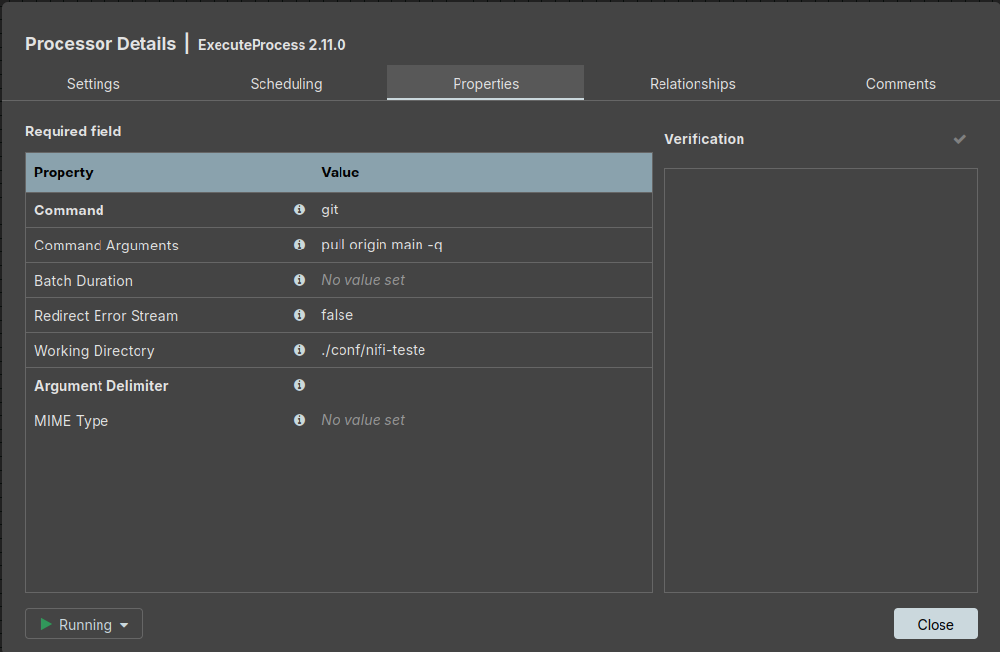
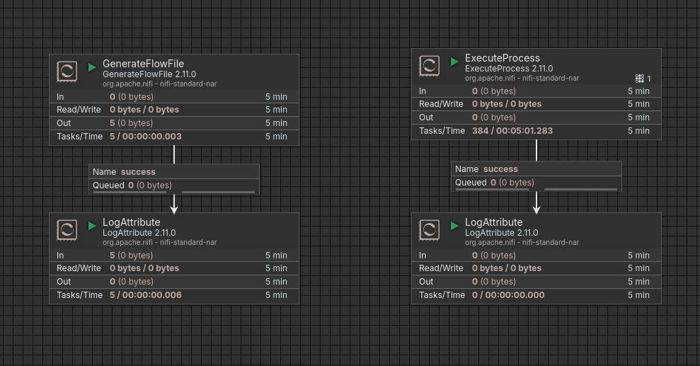
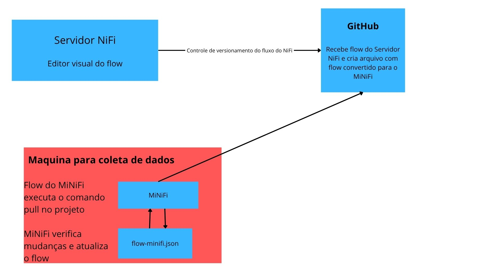

# Dynamic Flow Update for MiNiFi

Ambiente que demonstra como manter agentes **MiNiFi** atualizados automaticamente a partir de um flow versionado no **GitHub**, sem precisar reimplantar cada agente manualmente.

## Visão geral do pipeline

1. Você desenha o flow no **NiFi** (servidor) e o coloca sob controle de versão apontando pra um repositório do GitHub.
2. Um **GitHub Actions workflow** converte o flow (`NiFi-Flow.json`) para o formato lido pelo MiNiFi (`flow-minifi.json`) usando o **MiNiFi Toolkit**.
3. Cada agente **MiNiFi** roda um `git pull` periódico (via um processor `ExecuteProcess` no próprio flow) e recarrega o `flow-minifi.json` sempre que ele muda.

```
dinamic-flow-update-for-minifi/
├── nifi/
│   ├── docker-compose.yaml
│   ├── Dockerfile
│   └── conf/               # gerado nos passos abaixo
│       └── nifi-teste/     # clone do repositório GitHub criado abaixo
└── minifi/
    └── minifi-2.11.0/
        └── conf/
            └── nifi-teste/ # clone do repositório GitHub criado abaixo
```

## Índice

- [1. NiFi (servidor)](#1-nifi-servidor)
- [2. GitHub — repositório e token](#2-github--repositório-e-token)
- [3. Conectando o NiFi ao GitHub](#3-conectando-o-nifi-ao-github)
- [4. Pipeline de conversão do flow (GitHub Actions)](#4-pipeline-de-conversão-do-flow-github-actions)
- [5. Espelhando o repositório dentro do servidor NiFi](#5-espelhando-o-repositório-dentro-do-servidor-nifi)
- [6. Criando os fluxos de teste no NiFi](#6-criando-os-fluxos-de-teste-no-nifi)
- [7. MiNiFi (agente)](#7-minifi-agente)
- [8. Testando o fluxo completo](#8-testando-o-fluxo-completo)
- [9. Arquitetura](#9-arquitetura)

---

## 1. NiFi (servidor)

### 1.1 Criar as pastas do projeto

```bash
mkdir nifi
mkdir minifi
```

### 1.2 `nifi/docker-compose.yaml`

```yaml
services:
  nifi:
    build: .
    container_name: nifi
    restart: unless-stopped

    ports:
      - "8443:8443"   # HTTPS

    environment:
      # Web / HTTPS
      NIFI_WEB_HTTPS_HOST: 0.0.0.0
      NIFI_WEB_HTTPS_PORT: 8443

      # Single user auth (login inicial)
      SINGLE_USER_CREDENTIALS_USERNAME: admin
      SINGLE_USER_CREDENTIALS_PASSWORD: sejalivrenifi2026

    volumes:
      # Configuração
      - ./conf:/opt/nifi/nifi-current/conf

      # Logs
      - ./logs:/opt/nifi/nifi-current/logs

      # Repositórios (estado do NiFi)
      - ./state:/opt/nifi/nifi-current/state
      - ./database_repository:/opt/nifi/nifi-current/database_repository
      - ./flowfile_repository:/opt/nifi/nifi-current/flowfile_repository
      - ./content_repository:/opt/nifi/nifi-current/content_repository
      - ./provenance_repository:/opt/nifi/nifi-current/provenance_repository

    networks:
      - nifi-net

networks:
  nifi-net:
    driver: bridge
```

### 1.3 `nifi/Dockerfile`

Foi criado um Dockerfile para podermos incluir o `git`, que é necessário para o servidor conseguir executar o `ExecuteProcess` que fara o `git pull` mais a frente sem erros.

```dockerfile
FROM apache/nifi:2.11.0
USER root
RUN apt-get update && apt-get install -y git && rm -rf /var/lib/apt/lists/*
USER nifi
```

### 1.4 Criar pastas de dados e ajustar permissões

Essas pastas são os volumes montados no `docker-compose.yaml`. Precisam existir no host e pertencer ao UID `1000` (usuário `nifi` dentro do container).

```bash
cd nifi
mkdir conf logs state database_repository flowfile_repository content_repository provenance_repository
sudo chown -R 1000:1000 conf logs state database_repository flowfile_repository content_repository provenance_repository
```

### 1.5 Primeira execução — populando a pasta `conf`

Como a pasta `./conf` está vazia, o bind mount `./conf:/opt/nifi/nifi-current/conf` **substitui** a pasta `conf` que já vem dentro da imagem (com o `nifi.properties` padrão). Sem esses arquivos, o NiFi falha logo na subida com um erro parecido com:

```
nifi  | File [/opt/nifi/nifi-current/conf/nifi.properties] uncommenting [nifi.python.command]
nifi  | sed: can't read /opt/nifi/nifi-current/conf/nifi.properties: No such file or directory
nifi exited with code 2 (restarting)
```

Por isso, na primeira subida, o `conf` precisa ser populado manualmente com os arquivos padrão da imagem:

1. **Comente** a linha do volume `conf` no `docker-compose.yaml`:
   ```yaml
   volumes:
     # - ./conf:/opt/nifi/nifi-current/conf   # comentado só na primeira subida
     - ./logs:/opt/nifi/nifi-current/logs
     # ...demais volumes
   ```

2. **Suba o container** para o NiFi gerar os arquivos padrão internamente:
   ```bash
   docker compose up -d
   ```

3. **Copie os arquivos gerados** para o host:
   ```bash
   sudo docker cp nifi:/opt/nifi/nifi-current/conf/. ./conf/
   sudo chown -R 1000:1000 ./conf
   ```

4. **Descomente** a linha do volume `conf` e suba novamente:
   ```bash
   docker compose down
   docker compose up -d
   ```

> 💡 Se o mesmo erro aparecer para `state`, `database_repository` etc., repita esse processo para a pasta em questão.

### 1.6 Acessar o NiFi

```
https://localhost:8443/nifi/
```

- **login:** `admin`
- **senha:** `sejalivrenifi2026` *(defina a sua no `docker-compose.yaml`)*


---

## 2. GitHub — repositório e token

1. Crie um repositório no GitHub (pode ser **privado** por segurança) — ex.: `nifi-teste`.
2. Adicione um `README.md` inicial.
3. Gere um **Personal Access Token (classic)**:
   `Settings > Developer settings > Personal access tokens > Generate new token (classic)`
   Conceda permissão de **repo** (acesso a repositórios).

> 🔒 Guarde o token com cuidado — ele será usado para autenticar o `git clone`/`git pull` tanto no NiFi quanto no MiNiFi, e também no Registry Client do NiFi.

> 🔒 Você pode utilizar estes tokens para limitar o acesso dos agentes, utilizando tokens individuais e excluindo caso deseje desabilitar um agente minifi


---

## 3. Conectando o NiFi ao GitHub

### 3.1 Criar o Registry Client

No menu superior direito (ícone de 3 barras): **Controller Settings → Registry Clients** → adicione um **`GitHubFlowRegistryClient`** com:

| Campo | Valor (exemplo) |
|---|---|
| Repository Owner | `Migueldv06` |
| Repository Name | `nifi-teste` |
| Authentication Type | Personal Access Token |
| Personal Access Token | `********` |


### 3.2 Colocar o process group sob controle de versão

No seu process group, clique com o botão direito → **Version → Start version control**:

- Selecione o `GitHubFlowRegistryClient` criado acima.
- Informe um **Flow Name** (ex.: `NiFi-Flow`).
- Clique em **Save**.

A partir daqui, toda alteração no flow pode ser commitada diretamente para o repositório pelo próprio NiFi.

---

## 4. Pipeline de conversão do flow (GitHub Actions)

### 4.1 Clonar o repositório e baixar o MiNiFi Toolkit

```bash
git clone git@github.com:Migueldv06/nifi-teste.git
cd nifi-teste

wget https://dlcdn.apache.org/nifi/2.11.0/minifi-toolkit-2.11.0-bin.zip
unzip minifi-toolkit-2.11.0-bin.zip
rm minifi-toolkit-2.11.0-bin.zip
```

O **MiNiFi Toolkit** é quem converte o flow exportado do NiFi (formato `NiFi-Flow.json`) para o formato lido pelos agentes MiNiFi (`flow-minifi.json`).

### 4.2 Criar o workflow

No GitHub, aba **Actions → simple workflow → Configure**, crie o arquivo `.github/workflows/gerar-flow-minifi.yml`:

```yaml
name: Gerar Flow MiNiFi

on:
  push:
    branches:
      - main
    paths:
      - '**.json'
      - '**.xml'
      - 'minifi-toolkit-2.11.0/**'

jobs:
  build-and-convert:
    runs-on: ubuntu-latest
    # Concede permissão de escrita para salvar o commit no repositório
    permissions:
      contents: write

    steps:
      - name: Checkout do código
        uses: actions/checkout@v4

      - name: Configurar Java 21
        uses: actions/setup-java@v5
        with:
          distribution: 'temurin'
          java-version: '21'

      - name: Dar permissão aos scripts do Toolkit
        run: chmod -R +x ./minifi-toolkit-2.11.0/bin/

      - name: Executar conversão
        run: ./minifi-toolkit-2.11.0/bin/config.sh transform-nifi ./default/NiFi-Flow.json ./default/flow-minifi.json

      # Salva e envia o arquivo atualizado para o repositório
      - name: Commitar e enviar alterações
        uses: stefanzweifel/git-auto-commit-action@v5
        with:
          commit_message: "chore: atualizar flow-minifi.json via pipeline [skip ci]"
          file_pattern: 'default/flow-minifi.json'
```

**O que ele faz:** a cada `push` na `main` que altere `.json`, `.xml` ou o próprio toolkit, ele instala o Java 21, roda `config.sh transform-nifi` para converter o flow, e commita o `flow-minifi.json` resultante de volta no repositório.

> ⚠️ Confira se os nomes de arquivos/pastas usados no workflow (`./default/NiFi-Flow.json`) batem com os nomes reais gerados pelo NiFi no seu repositório.

### 4.3 Subir as alterações e validar

```bash
git pull && git add . && git commit -m "adicionando minifi toolkit" && git push
```

Depois, no NiFi, edite o flow e clique em **Save** (commit da versão). Verifique se o arquivo `default/flow-minifi.json` foi gerado/atualizado no repositório pela Action.

<!--
📸 Sugestão de imagem: print da aba Actions do GitHub mostrando o workflow rodando com sucesso.

-->

---

## 5. Espelhando o repositório dentro do servidor NiFi

O flow de teste usa um processor `ExecuteProcess` que roda `git pull` dentro de `./conf/nifi-teste`. Essa pasta precisa existir e conter o clone do repositório para o processor não falhar:

```bash
cd dinamic-flow-update-for-minifi/nifi/conf/
sudo git clone https://Migueldv06:<TOKEN>@github.com/Migueldv06/nifi-teste.git nifi-teste
sudo chown -R 1000:1000 nifi-teste
```

> Essa pasta **não interfere** no funcionamento do servidor NiFi em si — ela existe apenas para o NiFi ter o "mesmo ambiente" (a mesma estrutura de repositório) que os agentes MiNiFi terão, permitindo testar o `ExecuteProcess` localmente antes de replicar nos agentes.

---

## 6. Criando os fluxos de teste no NiFi

### 6.1 Fluxo de teste simples

Crie um **process group** de teste com:

- `GenerateFlowFile` (com um atributo/conteúdo de teste)
- ligado a um `LogAttribute`

Serve só para gerar dados e confirmar que o flow versionado está sendo aplicado corretamente.

### 6.2 Fluxo de atualização dinâmica (`git pull` periódico)

Crie outro fluxo com um processor **`ExecuteProcess`**:

| Propriedade | Valor |
|---|---|
| Command | `git` |
| Command Arguments | `pull origin main -q` |
| Working Directory | `./conf/nifi-teste` |
| Scheduler | `1 min` (ajuste conforme desejado) |



Ligue a saída dele a um `LogAttribute` e descarte o flow file em seguida (ele serve só como "gatilho" do `git pull`, não carrega dado útil).

> Se a pasta `./conf/nifi-teste` ainda não existir, o `ExecuteProcess` vai gerar alerta de erro — veja a [seção 5](#5-espelhando-o-repositório-dentro-do-servidor-nifi).





---

## 7. MiNiFi (agente)

### 7.1 Download

```bash
cd ~/Downloads/dinamic-flow-update-for-minifi/minifi
wget https://dlcdn.apache.org/nifi/2.11.0/minifi-2.11.0-bin.zip
unzip minifi-2.11.0-bin.zip
rm minifi-2.11.0-bin.zip
```

### 7.2 `conf/bootstrap.conf`

Edite (ou adicione ao final) `minifi-2.11.0/conf/bootstrap.conf`:

```bash
nano minifi-2.11.0/conf/bootstrap.conf
```

```properties
nifi.minifi.notifier.ingestors=org.apache.nifi.minifi.bootstrap.configuration.ingestors.FileChangeIngestor
nifi.minifi.notifier.ingestors.file.config.path=./conf/nifi-teste/default/flow-minifi.json
nifi.minifi.notifier.ingestors.file.polling.period.seconds=1
```

| Parâmetro | Descrição |
|---|---|
| `nifi.minifi.notifier.ingestors` | Classe responsável por detectar mudanças no arquivo de flow. |
| `...ingestors.file.config.path` | Caminho do `flow-minifi.json` que o MiNiFi deve observar e recarregar quando mudar. |
| `...file.polling.period.seconds` | Intervalo (segundos) entre cada verificação de mudança no arquivo. |

### 7.3 Clonar o repositório dentro do agente

O caminho configurado acima (`./conf/nifi-teste/...`) precisa existir de fato:

```bash
cd ~/Downloads/dinamic-flow-update-for-minifi/minifi/minifi-2.11.0/conf/
git clone https://Migueldv06:<TOKEN>@github.com/Migueldv06/nifi-teste.git nifi-teste
```

### 7.4 Executar

```bash
cd ~/Downloads/dinamic-flow-update-for-minifi/minifi/minifi-2.11.0/bin/
./minifi.sh run
```

Acompanhe os logs — é neles que você vai ver o `GenerateFlowFile` sendo executado a cada ciclo.

---

## 8. Testando o fluxo completo

1. No NiFi, edite a mensagem do `GenerateFlowFile` (ex.: `"ola miguel"` → `"ola miguel v2"`).
2. Faça o commit da versão do flow (**Version → Commit local changes**).
3. Aguarde a Action rodar e atualizar o `default/flow-minifi.json` no repositório.
4. No servidor, o `ExecuteProcess` (rodando a cada 1 min) puxa a atualização via `git pull` em `conf/nifi-teste`.
5. No agente MiNiFi, o `FileChangeIngestor` detecta a mudança no `flow-minifi.json` e recarrega o flow automaticamente.
6. Verifique nos logs do MiNiFi (`./bin/minifi.sh run`) se a nova mensagem aparece.

## 9. Arquitetura

Imagem ilustrando a arquitetura do sistema:


